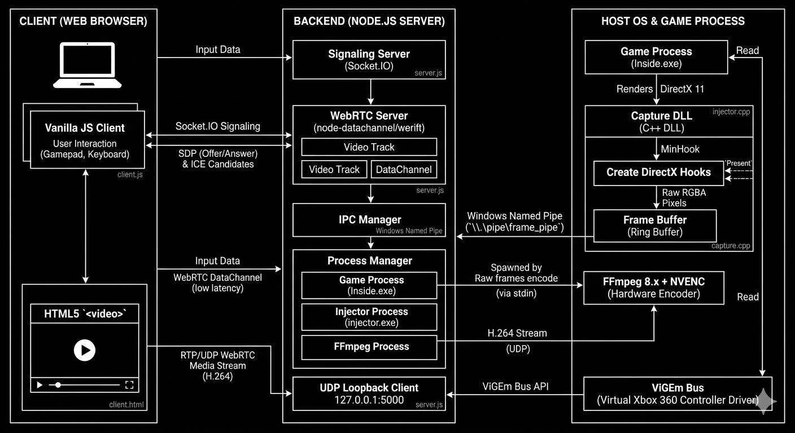

# Frame-Jack


Low-latency browser-based game streaming over LAN. Captures raw GPU frames via DirectX 11 hook, encodes with NVENC H.264, and delivers via WebRTC — no cloud provider, no SDK dependencies.


## Architecture

<p align="start">
  
</p>

## Demo

<p align="start">
  
</p>


## Overview

| Spec | Implementation |
|------|---------------|
| **Capture** | DirectX 11 API hook (MinHook) |
| **Transport** | Named Pipe → FFmpeg → WebRTC |
| **Latency Target** | &lt; 50ms end-to-end |
| **Input** | Virtual Xbox 360 controller (ViGEm) |

## Tech Stack

<div align="start">

### Capture & Injection


### Encoding & Transport


### Input & Hardware


### Client


</div>

## Architecture

### Frame Capture (`dllmain.cpp`)
- Injects into game process via `LoadLibraryW` remote thread
- Hooks `IDXGISwapChain::Present` (vtable index 8) using MinHook
- Copies back buffer → staging texture → CPU-mapped RGBA
- Lock-free ring buffer (3 slots, atomic) for frame queuing
- Consumer thread serializes to Named Pipe with 40-byte header

**FrameHeader Structure (40 bytes, packed):**
magic(4) | headerSize(4) | frameId(8) | writeTimeNs(8) |
width(4) | height(4) | rowPitch(4) | payloadSize(4)
plain
Copy

### Streaming Server (`index.js`)
- Parses binary pipe stream by magic number (`0x4D415246`)
- 4-frame queue priming prevents encoder starvation
- FFmpeg NVENC: RGBA stdin → RTP/UDP (`127.0.0.1:5000`)
- UDP intercept rewrites SSRC, forwards via WebRTC SRTP
- Socket.IO signaling (offer/answer/ICE)
- ViGEm virtual controller for input injection

### Browser Client
- `RTCPeerConnection` with forced H264 (`profile-level-id=42e02a`)
- `playoutDelayHint = 0` for minimal buffering
- Unreliable DataChannel (`maxRetransmits: 0`) for input
- Vanilla JS + HTML5 `<video>`

## Quick Start

### Requirements
- Windows 10/11 x64
- NVIDIA GPU (NVENC support)
- Node.js 18+
- [ViGEm Bus Driver](https://github.com/nefarius/ViGEmBus/releases)
- Visual Studio 2022

### Build
```bash
# Build capture DLL and injector
msbuild dll/Dx11Hook/Dx11Hook.sln /p:Configuration=Debug /p:Platform=x64
msbuild Injector/injector/injector.sln /p:Configuration=Debug /p:Platform=x64
Run
bash
Copy
cd backend
npm install
# Run as Administrator (required for ViGEm)
node index.js
Open http://127.0.0.1:3000
```
### RUN
```bash

cd backend
npm install
# Run as Administrator (required for ViGEm)
node index.js

```
### Limitations
- LAN only — no STUN/TURN implementation
- Single client — no reconnection handling
- Timing — cyclic stutter every 3-5s (keyframe/RTP reorder investigation pending)
